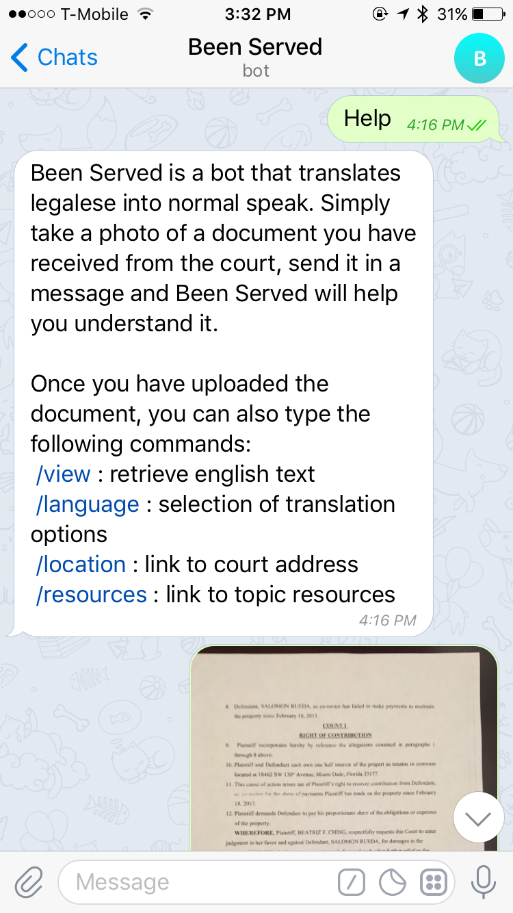
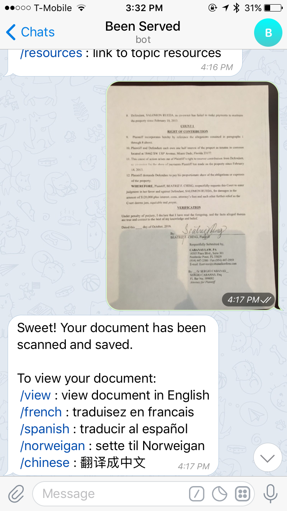
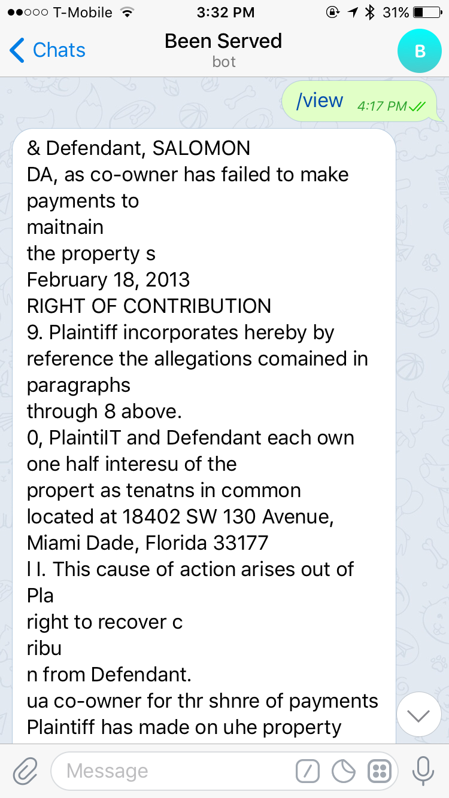
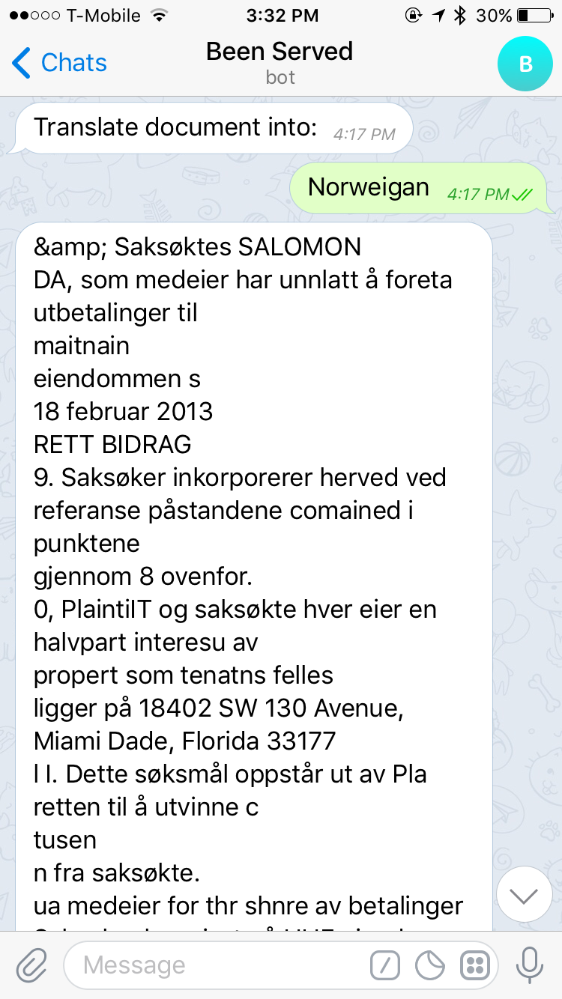
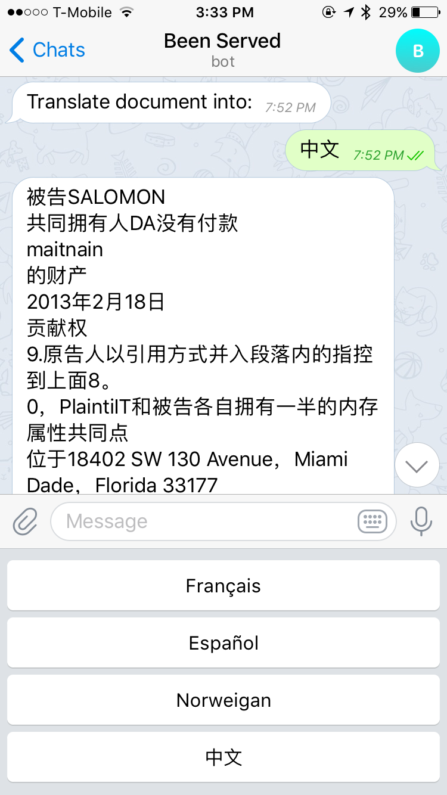

# Been Served
_A Bot Service to Help You Understand Your Legal Options_  
**by Richard J & Peter Ching**

## Introduction
Been Served is a telegram chat bot built for [CourtHack 2017](http://courthack.org) which translates court summons into the native language of the recipient. Been Served uses a combination of OCR and machine translation to convert a photo of a summons into text which can then be read in any language in order to help solve Challenge 4: Translating Legalese into Folksonomy of the hackathon.

## Benefits
- Explains the nature of the summons
- Finds legal resources appropriate to the summons
- Translates document into native language

## Project Materials
[GitHub Repo](https://github.com/rj919/beenserved)

## Features
- Interacts through a conventional messaging platform
- Performs optical character recognizition on photos
- Retrieves summons details and court case filings
- Identifies resource links in jurisdiction for proceeding

## Components
- TelegramBot API (messaging)
- Googe Vision API (OCR)
- Google Translate API (translation)
- Flask (web framework)
- Python (language)

## Screenshots
__Entry/Help:__  

__Scan Document:__

__View Text:__

__Norwegian Translation:__

__Mandarin Translation:__

